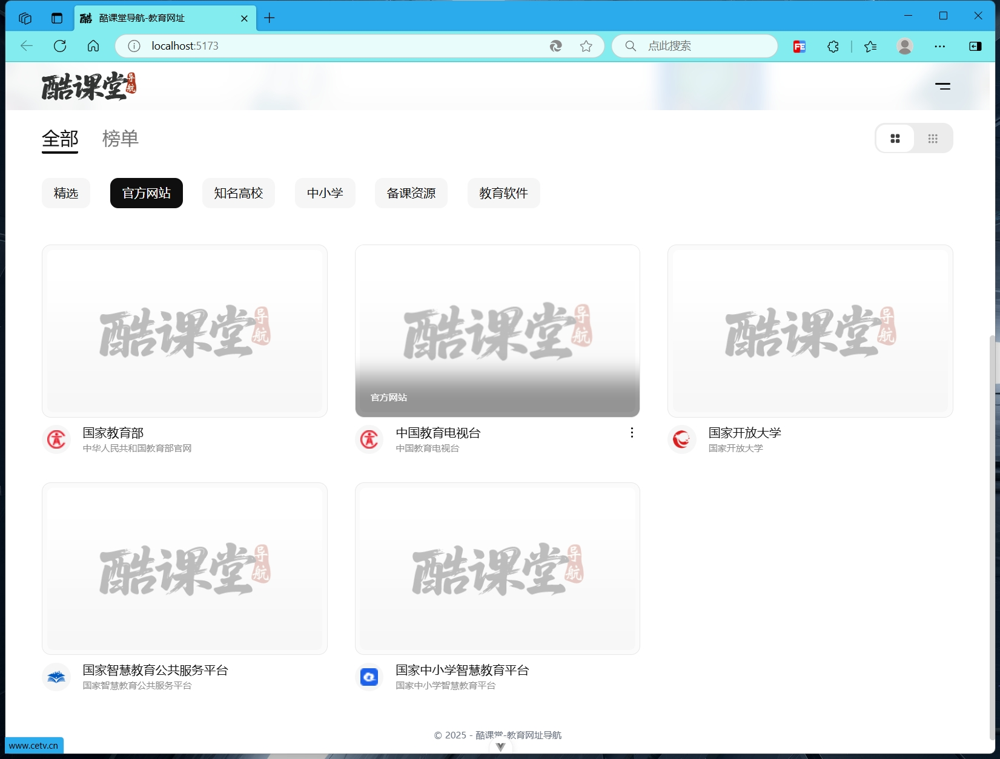
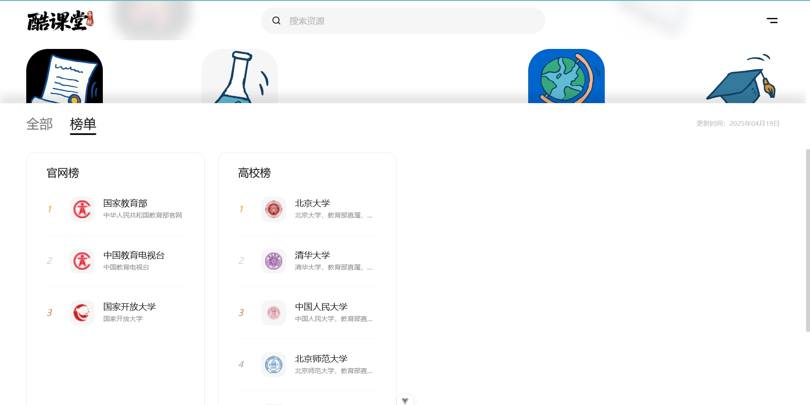

<p align="center">

</p>
<p align="center">
酷课堂导航是一个免费、基于Vue+TS开发的网址导航纯前端项目，界面优雅简洁，自适应客户端，直接修改构建后发布项目即可。
</p>

## 技术特点

- 基于Vue+TS开发
- 引入了Bootstrap-vue-next、TailwindCSS

## 预览






## 项目安装与运行

### 安装相关依赖

```sh
npm install
```

### 编译开发调试

```sh
npm run dev
```

### 构建项目前端代码

```sh
npm run build
```

## 💬 项目交流

加微信：59466966（注明本项目名）
