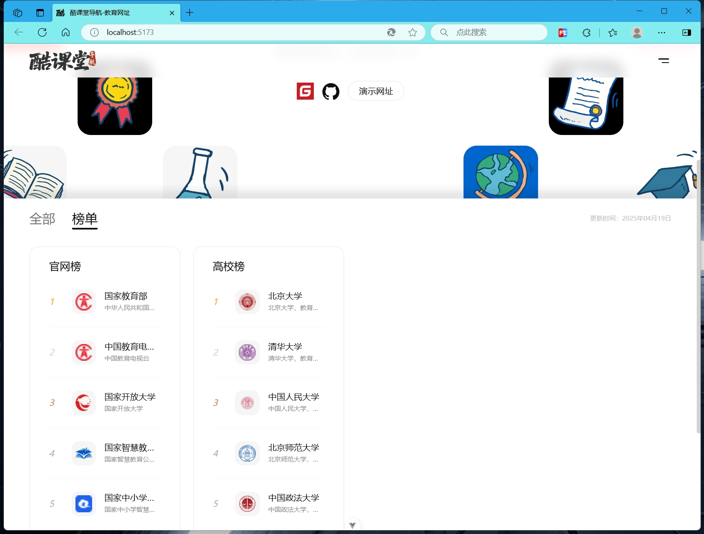

# 酷课堂导航

酷课堂导航是一个免费、基于Vue+TS开发的网址导航，界面优雅简洁，自适应客户端，直接修改构建后发布项目即可。

- 如果觉得这个项目对你有帮助，请给个Star吧。

## 技术特点

- 基于Vue+TS开发
- 引入了Bootstrap-vue-next、TailwindCSS

## 预览





## 项目安装与运行

```sh
npm install
```

### Compile and Hot-Reload for Development

```sh
npm run dev
```

### Type-Check, Compile and Minify for Production

```sh
npm run build
```

### Lint with [ESLint](https://eslint.org/)

```sh
npm run lint
```
